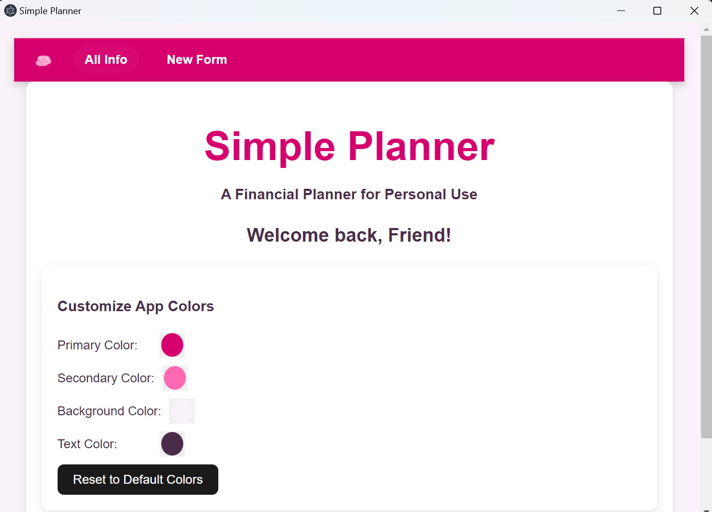
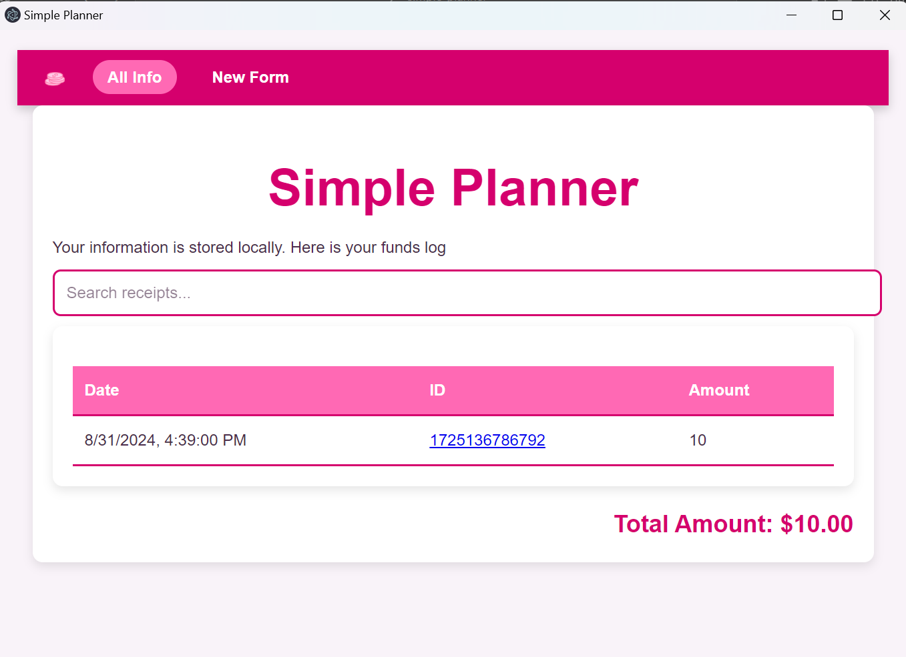
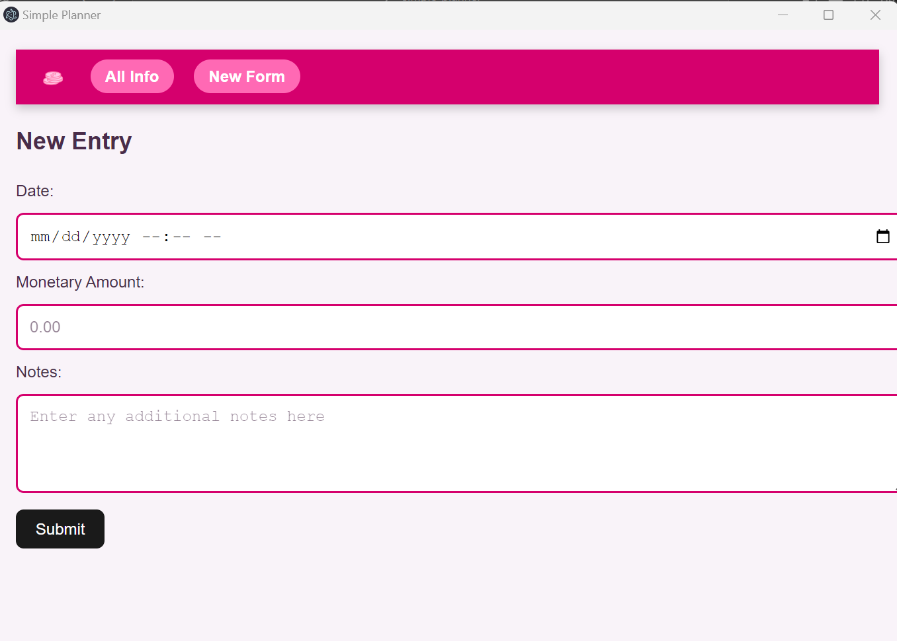

# Simple-Planner

A simple finance planner app using localStorage for your privacy! (as opposed to an external database)

## Home Page with App Color Chooser

## Index Page with Search via ID

### New Form Page

### Development

This app is without a database and functions on localStorage. About 6000 entries can be logged on this app according to AI estimates such as from ChatGPT. This app is tested to work, but 6000 entries is untested. There may be small bugs and this application is in continual development. The app was developed with Perplexity AI to stream line development process.

